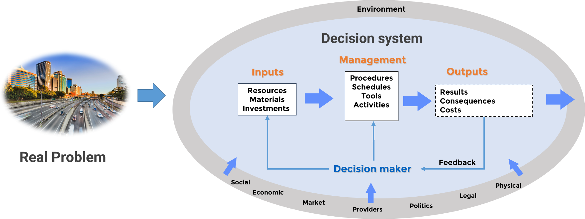

Introduction: Python Notebooks for Operations Research
======================================================
This chapter covers some fundamentals of Jupyter Notebooks for Operations Research, Python programming, and basic tutorials and usage tips for two important libraries: Numpy and Matplotlib.

Brief introduction to Jupyter Notebooks
________________________________________
`Jupyter Notebooks <https://jupyter.org/>`_ are great to share software and scientific results. In my opinion, the main advantages are:

#. **Explainability**: Jupyter Notebooks combine software code together with rich multimedia descriptions. This allows researchers to **explain** their results, show exactly the code the have used, describe its fundamentals and its results. This narrative format helps the reader understand and in extension reuse scientific results.
#. **Composability**: You can easily combine different Jupyter Notebooks into larger project.
#. **Community Support**: There is a very large user community worldwide supporting Jupyter Notebooks.

Also, there are a growing number of platforms and tools that support it off-the-shelf. Some examples that we will use during the course are:
`Anaconda <https://www.anaconda.com/>`_, `Google Colabs <https://colab.research.google.com/>`_, `JupyterLab <https://mybinder.org/v2/gh/jupyterlab/jupyterlab-demo/master?urlpath=lab/tree/demo>`_, or `Pycharm <https://www.jetbrains.com/pycharm/>`_.

From a very basic point of view, a Jupyter Notebook is a file that contains a sequence of **cells**. There are primarily two types of cells:

*   **Code Cells**: Code cells contain code in a given programming language (for instance Python) that will be executed by an **interpreter** when we execute the Notebook. Code cells have an output section where we can see the result of the code cell. From this, there are two ways we can use a Notebook. We can *view* a Notebook using a viewer, which allows us to render the Notebook, but not to run the code cells. If we have an Interpreter at hand, we can also **run** the Notebook to let the interpreter run the code and update the results of code cells.
*   **Markdown Cells**: Markdown cells use `Markdown Syntax <https://www.markdownguide.org/basic-syntax/>`_ to explain code cells using a rich language that allows us to include links, equations, images, any kind of resource we can think of to support our presentation.

Based on these definitions, this chapter contains the Notebooks in the Table of Contents below.

Operations Research Introduction
_________________________________
Motivation
^^^^^^^^^^^
The main objective of operations research is to support decision making through methods and techniques based on the scientific method and mathematics.
Formally, making a decision is the process of selecting the best alternative between a set of alternative options. Depending on the problem, there can be a finite set or an infinite set of alternative options.
The connection between Operations Research and management is clear: Managers make decisions and in extension, decision making is strongly connected to management. From this perspective, Operations Research gathers a set of tools that identify the best (optimal) alternative in a systematic way, based on a set of assumptions that allows us to model the decision making process using the mathematical language.

To provide a clear framework for the book, the scope of the problems that will be addressed relate to specific **management levels**, and **business processes**.

Management Framework
^^^^^^^^^^^^^^^^^^^^^
Business processes
^^^^^^^^^^^^^^^^^^
Business processes represent the group of activities needed to produce goods or services.
From a very fundamental point of view, any company produces goods or service and delivers these good or services to customers.
Likewise, the company has to purchase the goods or services that are needed to produce and deliver their offer from a set of suppliers. Obviously, every organisation needs to make good decisions in these processes to remain to be competitive.
Normally, companies are organised into different business units or departments. Some examples are the sourcing department, in charge of purchases, the engineering department in charge of product design and production, sales, financing, marketing, human resources. Managing these departments means making decisions, and these decisions must be aligned to meet the objectives of the company.

The Supply Chain Operations Reference model (SCOR) provides a model for the management processes involved in a company, the Supply Chain Reference Model,
In the SCOR model, we identify six management processes:

- **Plan**: The first is the Plan, which groups all processes that determines the best course of action to meet the requirements of the rest of the processes.
- **Source**: The second group are source processes, which are in charge of provisioning resources needed to meet the demand for our products.
- **Make**: The third are Make processes, which transform the goods and services of the suppliers into the good or services that meet the demand of our customers.
- **Deliver**: Then, we have the deliver processes which imply the needed transportation, and logistics necessary to deliver our products and services.
- **Return**: The return processes deal with the returning of products or services from customers because they do not meet the requirements or the level of service that was agreed, but also the return of good or services to our suppliers for the same reason.
- **Enable**: And finally, enable processes which are associated with the management of the supply chain, that is the management of the relationships with our collaborators, both customers and suppliers.

Operations Research provides tools to support decision making in these management processes. All the problems included in this interactive book can be mapped to the processes in the SCOR model.

Management levels
^^^^^^^^^^^^^^^^^^
Management levels divide management and therefore decision making into three planes that are traversal to the entire company: The strategic level, the tactical level and the operational level.

Each level has its own responsabilities and all work towards the same goals, to achieve the same objectives. The main differences between levels is that they deal with different time scales.

- **Strategic level**: The strategic level deals with long term business decisions and assurance of business objectives in the future. Therefore, decisions at this level deal with long time periods or time horizons, in the range of several years. Consequently, they need to be revisited or updated with a periodicity in the range of months.

- **Tactical level**: The tactical level on the other hand deals with business decisions to ensure the fulfillment of the  objectives in the near future, for instance, in the next 1 or two years. Tactical level decisions need to be revisited every few months to ensure mid term performance. Some examples are for instance client acquisition or investment selection.

- **Operational level**: Finally, the operational level deals with intermediate-term decisions in processes, rather than business decisions. Operational management controls how the different processes, or the different units of an organisation implement the company´s strategic and tactical objectives. The operational level articulate specific processes and spans management decisions in smaller periods of time, from months to minutes. Consequently, they need to be revisited rather frequently.

Operations Research provides tools to support decision making in any of the three levels, although the O in OR clearly refers to the operational level.

Operations Research and Artificial Intelligence
________________________________________________
Operations Research is strongly connected to Artificial Intelligence (AI). The `European Union <https://ec.europa.eu/digital-single-market/en/news/definition-artificial-intelligence-main-capabilities-and-scientific-disciplines>`_ defines AI as:
    \"Artificial intelligence (AI) refers to systems that display intelligent behaviour by analysing their environment and taking actions - with some degree of autonomy - to achieve specific goals\"

Therefore, AI systems sense their environment and take optimal decisions to achieve specific goals. Clearly, from this definition, AI and OR are strongly related. Both disciplines make use of the same mathematical tools, primarily in the field of optimisation, to find the best course of action. However, particularly in this course, OR is focused on business management problems, while AI refers to any system that exhibits rationality (defined as the capability to perceive the environment and determine a course of action based on processed information).
OR is therefore a field of application of AI. From this perspective, this course describes the main mathematical techniques that support decision making and thus, it provides a good introduction to the field of AI, guided through business management problems.

Moreover, as described in the same document referenced above, broadly speaking, all such techniques can be grouped in two main groups, related to the capabilities of **reasoning** and **learning**.

.. image:: img/AI_and_OR.png
    :alt: AI techniques can be grouped into reasoning and machine learning

- **Reasoning**: These techniques allow an AI system to take as input the data coming from different sources and propose an action to take, given the goal to achieve.
- **Machine learning**: These techniques allow an AI system to learn how to solve problems that cannot be precisely specified, or whose solution method cannot be described by symbolic reasoning rules.

Let us emphasize again that this course in OR is mainly focused on reasoning techniques, techniques that allow us to find the best decision from a set of alternative options. The course will discuss extensively **optimisation** which is an entire field of mathematics dedicated to finding the **optimal** (normally the minimum or the maximum) solution among all **feasible** solutions. Due to the importance of these definitions, they are formally defined in a section below. The course will also cover **searching problems** and **Combinatorial Optimization**, which is the sub-field of optimisation dedicated to finding an optimal solution from a finite set of solutions.
The course will describe how complex problems in OR, like **planning** (eg finding the optimal allocation or resources to accomplish a specific objective) or **scheduling** (find the optimal order of activities that minimise the execution of an activity plan, given a limited set of resources), can be modeled and solved using advanced analytic techniques.

Although it is not a fundamental part of this course, the course will also describe how machine learning is strongly related to the same techniques and will discuss specific applications of machine learning in OR.

Reasoning
^^^^^^^^^
The reasoning capability can be further divided into four basic steps needed to be able to choose the best action (make a rational decision) to achieve one objective:

- **Problem modelling:** Obtain a mathematical representation of the decision making problem.
- **Input data collection:** Transform the available data into a format that can be input to the problem model
- **Reason with the input data:** (eg find the optimal solution among all possible alternatives)
- **Make a decision:** based on the provided result  (feedback)

Problem modelling
^^^^^^^^^^^^^^^^^^

The first part of the problem modelling process is to provide a clear definition of the objectives and the scope of management. In other words, the first question that one needs to answer is:

    What are the goals? And, what is the relationship between these goals and the decision or decisions under analysis?

The answer to these questions will be in the form of a set of variables, and mathematical expressions between these variables that will express the decision problem as a mathematical problem.

System theory is useful at this point to provide a clear framework to illustrate problem modelling.

The main components of the decision system are:

- **Inputs**: Representation of the (limited) resources managed by the decision maker. Management problems deal with scarce or limited resources that need to be managed efficiently.
- **Management**: Represent the decisions taken on **controllable decision variables**. That is, there will be a set of variables that quantify the management of the input resources and the values these variables can take represent the different decision alternatives available to the decision maker.
- **Environment**: There are also **uncontrollable variables**, meaning variables that have an effect in the decision making, but are determined by the environment, and therefore, they are not under the control of the decision maker.
- **Output**: Represent the results of the decision. Each different alternative will have a different effectiveness, ie will achieve the objective at a certain degree. The optimal solution is the most effective alternative. Measures of effectiveness are metrics used to determine effectiveness of the output and normally the optimal solution will be the maximum possible value (eg maximise profits) or the minimum possible value (eg minimise cost) of such metrics.

And depending on the model chosen, there will be different types of interactions between these model components. At this point, it is possible to classify models into two categories:

- **Normative models**: Normative models are designed to select the best alternative, by deriving a set of mathematical expressions that characterise the relationship between model components (output, input, decision variables, uncontrollable variables). Depending on the type of model, we will be able to use different techniques to find the optimal solution. Some examples are Linear or non-linear mathematical programming.
- **Descriptive models**: On the other hand, descriptive models are designed to describe the system behaviour. They allow us to experiment with the system and explore the effectiveness of the different alternatives, thus gaining in-depth knowledge of the problem that can be actioned in the decision making process. The most representative example of descriptive models is simulation.

The main model components are:

- **Objective function:** Mathematical relationship between result variables and decision variables. The objective function models the effectiveness of decisions.
- **Constraints:** Mathematical relationships between decision variables and uncontrollable variables. The constraints model other effects of the environment that are not accounted for in the objective function.

Data collection
^^^^^^^^^^^^^^^^
Data collection is the process that determines the values of the (technological) coefficients and uncontrollable variables in our model. In other words, data collection is the process that determines the value of the parameters of our model.
Before data collection, our model is an abstract model that represents *any* decision problem instance it has been designed for. For instance, we can derive an abstract model to determine the optimal investments subject to a set of constraints that model the market. But if we want to use this model to determine the optimal investments for our company, we need to input into this model our company data and give values to its parameters.

In this sense, there are different types of models depending on the nature of their parameters:

- **Deterministic models:** All model parameters are known with certainty
- **Stochastic models:** All model parameters are stochastic variables (ie there is some degree of uncertainty in their value)
- **Mixed models:** Models that combine deterministic and stochastic parameters

Reasoning
^^^^^^^^^^
Finally, once we have a specific instance of a model with our collected data, we are able to apply a technique to find the solution to the problem.

**Types of solutions**

There are however different types of solutions that we will be able to find:

- **Feasible solution:** It meets all the requirements and constraints set by the environment, otherwise the solution is **unfeasible**
- **Optimal solution:** It provides the best result of all feasible solutions. Normally, our objective is to find the optimal solution, but depending on the complexity of our problem, at times this might just not be possible
- **Sub-optimal solution:** It provides a bounded feasible solution, that is, a solution that is at a known maximum distance to the optimal solution.

**Types of techniques**

Depending on the problem model, we will have different mathematical techniques to find a solution to our problem. These techniques can be classified into the following categories:

- **Numerical Techniques:** Numerical techniques test the effectiveness of the different alternatives to find the optimal solution. Depending on the strategy used to explore the solution space, numerical techniques can be classified into the following categories:

    - **Enumeration (Brute force):** This is the simplest technique: Test ALL possible solutions.
    - **Algorithms:** Step-by-step procedure to find optimal solution
    - **Heuristic:** Step-by-step procedure to find a sub-optimal solution with a limited number of operations
    - **Simulation:** Test alternatives in a computer representation of the system
    - **Machine learning:** Configure a mathematical model to find a solution based on previous known results

- **Analytical Techniques** Analytical techniques provide a one-step method to find the solution. They can be further classified into:

    - **Optimal:** One step method to determine the optimal solution
    - **Sub-Optimal:** One step method to find sub-optimal solutions

Depending on the complexity of the problem, or the type of model, there will be different techniques available. If there are no techniques that can be applied,
then the problem is not workable and we need to find an alternative model. In other words, workability is a property of our model that determines whether it is possible to solve the problem with available techniques or not.

Making a decision
^^^^^^^^^^^^^^^^^^
Finally, through a technique, we are able to obtain a solution that represents the best alternative of the decision problem.
But, before we are able to implement this decision into the real world, it is important to validate that the model exhibits some fundamental properties:

- Consistency: verify that the model is valid when parameters are changed to the extreme
- Sensitivity Analysis: How is the response affected by changes in the parameters?
- Plausibility: Is the model consistent with available data?

If we are satisfied with the answer to these questions, we are ready to implement the best alternative in the real world and monitor the results. This implementation can be automatic (taken by an autonomous system) or supervised (with human supervision).

Introduction to Python and Markdown
____________________________________
The following Table of Contents provides access to different tutorials that introduce the basics of Python Programming, Markdown cell edition, and some of the main libraries that will be used throughout the course.

.. toctree::
    :maxdepth: 2
    :caption: Contents:
    :glob:
    :titlesonly:

    /Introduction/PythonTutorial
    /Introduction/Numpy tutorial
    /Introduction/Matplotlib tutorial
    /Introduction/Working With Markdown Cells
