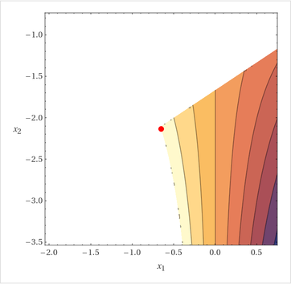
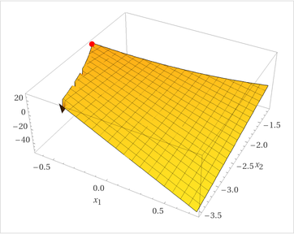

# 💡 AI tools for researchers

##  1️⃣ Perplexity

Use perplexity to make **focused** reasoning queries in one of these areas: 

- 📚 **Academic**: Make specific searches in academic papers. Perplexity will return a response with references to the academic papers that it used as a source.
- 🖉 **Writing**: Make queries to generate text and code (similar to ChatGPT)
- ⍺ **Wolfram Alpha**: Make queries to Wolfram Alpha to reason with mathematical expressions.
- 📼 **Youtube**: Make queries to Youtube to find videos that match your query.

👉 [Try it out](https://perplexity.ai/)

### Use perplexity to reason with mathematical expressions
You can use perplexity to reason with mathematical expressions, entering the expression in the prompt and selecting Wolfram Alpha as the focus. 
For example, you can use perplexity to solve optimization problems that can be solved with the method of Lagrange multipliers, systems of equations, and also use it to plot functions or explain mathematical concepts.

> **🗲 Example prompt (focus Wolfram Alpha):** max 4*x_1 5*x_2 subject to 3*x_1 1.2*x_2 <= 5; 4*x_1 - 6*x_2 >= 10
> 
> **☰ Example response:**  To solve the optimization problem of maximizing $4*x_1 5*x_2$ subject to the constraints $3*x_1 1.2*x_2 <= 5$ and $4*x_1 - 6*x_2 >= 10$ we can use the method of Lagrange multipliers. However, we can also use WolframAlpha to obtain the solution. According to WolframAlpha, the maximum value of the objective function is approximately 27.7778, and it is achieved at $x_1 approx -0.650535$ and $x_2 approx -2.135$. Here's a contour plot of the feasible region and the objective function: 
> 
> 
> As we can see from the plot, the feasible region is the shaded area, and the maximum value of the objective function is achieved at the point where the contour lines are closest together.
> 
> 

### Use perplexity to make specific searches in academic papers
You can use perplexity to make specific searches in academic papers, entering the search query in the prompt and 
selecting Academic as the focus. Perplexity will return a detailed description of the reasoning prompt including references to acamedic papers. It will also provide related content and papers to continue the search.
You can use it for instance while you are writing a paper, to find related work, or to find papers that are related to a specific topic. In the responses, references are linked to the original papers and can be accessed by clicking on them.

> **🗲 Example prompt (focus Academic):** Contemporary manufacturing domain is undergoing a vast change as an outcome of the mature now Industry 4.0 framework. The global transition from traditional manufacturing systems to Industry 4.0 compatible systems has already begun. Therefore, the digitization of the manufacturing systems across the globe is increasing with exponential growth which implies a significant increase to the volume and variety of the generated data
> 
> **☰ Example response:** Industry 4.0 is a digital transformation that aims to integrate computing, software, and internet technologies to significantly increase productivity, efficiency, and self-managing production processes 1, 2, 3, 4. The digitization of manufacturing systems across the globe is increasing with exponential growth, which implies a significant increase in the volume and variety of generated data.
Smart factories employ IoT devices that connect machines and computers to get a clear picture of the manufacturing facility with real-time data 1, 4. The technology for capturing and processing data, integrating it with information from ERP, and using it to drive efficiencies and insights to the shop floor is much more accessible, making Industry 4.0 much more attainable for small- to medium-sized manufacturers 5. The benefits of Industry 4.0 include greater agility, flexibility, and operational performance 3.The benefits of Industry 4.0 include greater agility, flexibility, and operational performance 6.
